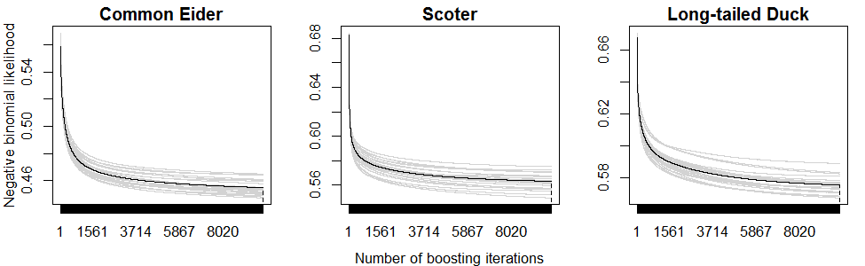
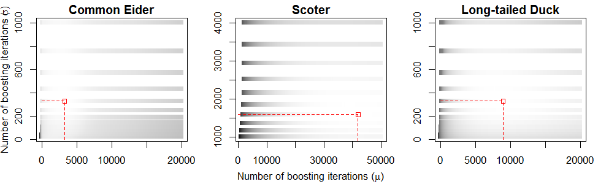

---
header-includes:
#  - \usepackage[utf8]{inputenc} 
#  - \usepackage[parfill]{parskip}
output: 
  pdf_document:
fontsize: 12pt
geometry: margin=1in
number_sections: true
documentclass: article
bibliography: NantucketMS.bib
csl: ecology.csl
---
# Appendix 3. Early stopping

## Occupancy models

All occupancy models converged (or nearly so in the case of Common Eider) to the maximum likelihood estimates (i.e., did not stop early; Figure 3.1).

```{r early_stopping_occupancy, echo=FALSE, eval=FALSE}
# Figure 3.1 was created using the following script, although for nice formatting
# (and time considerations) we simply link to the final PNG file, below
source("../R/early_stopping_occupancy_plot.R")
```
  
**Figure 3.1** Bootstrapped out-of-bag empirical risk in sea duck occupancy models based on 25-fold subsampling.  Gray lines indicate the out-of-bag risk on each subsample and the black line indicates the average out-of-bag risk; the optimal iteration is indicated by the dashed vertical line.

## Count models

In contrast to occupancy model, bootstrapping prescribed early stopping for both parameters in all count models (Figure 3.2).  **Elaborate on** **_why we need more iterations for the scoter model is simply a result from the fact that the scoter model is more complex or at least takes longer to "converge"_**

```{r early_stopping_count, echo=FALSE, eval=FALSE}
# Figure 3.2 was created using the following script, although for nice formatting
# (and time considerations) we simply link to the final PNG file, below
source("../R/early_stopping_count_plot.R")
```
  
**Figure 3.2** Bootstrapped out-of-bag empirical risk in sea duck conditional count models based on 25-fold subsampling.  Lighter colors indicate lower average out-of-bag risk (over the 25 samples) for a given combination of *m*~stop~-values for $\mu$ and $\sigma$; the optimal combination is indicated by the red square. 