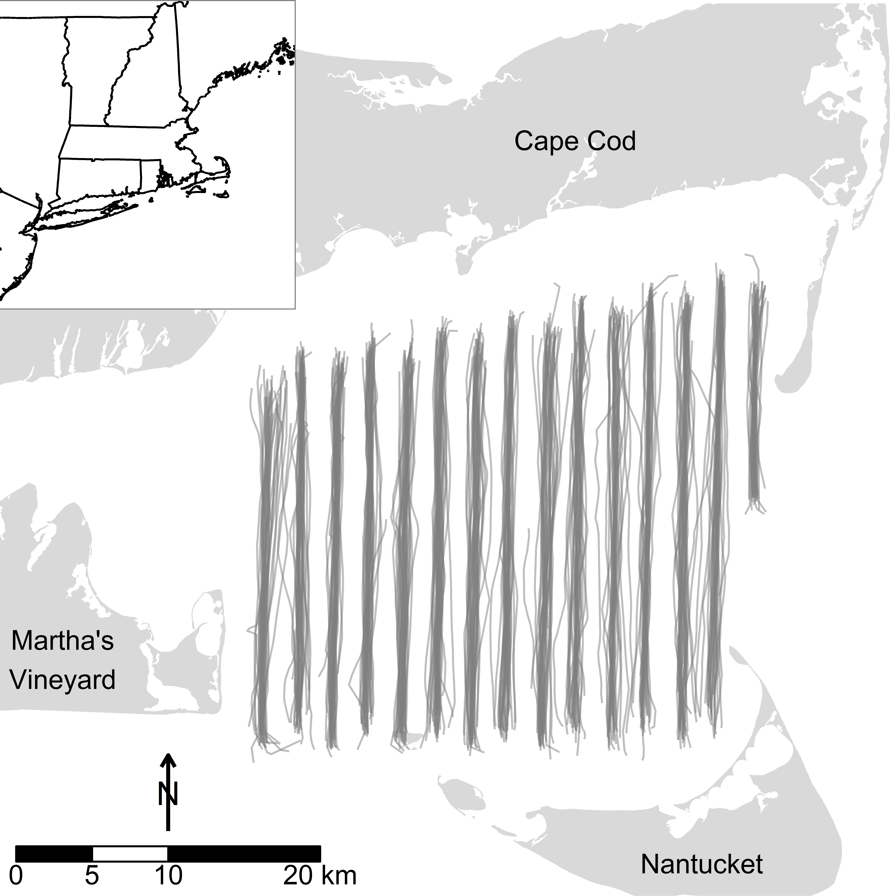
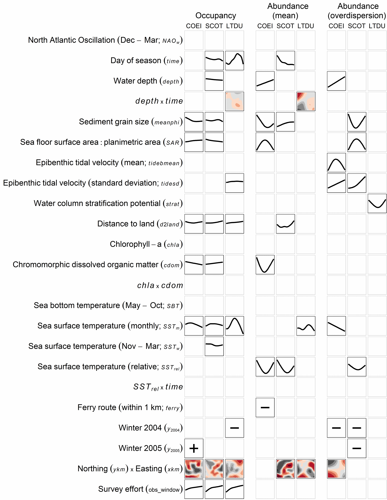
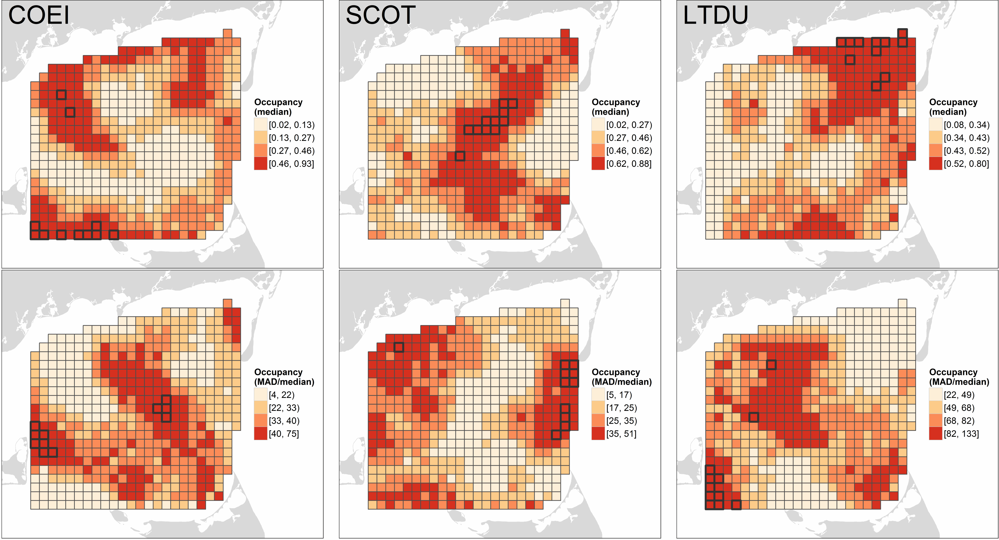
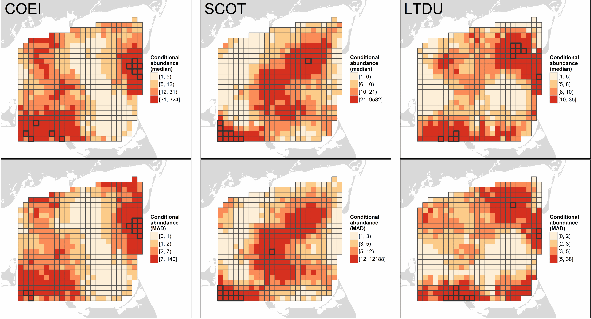
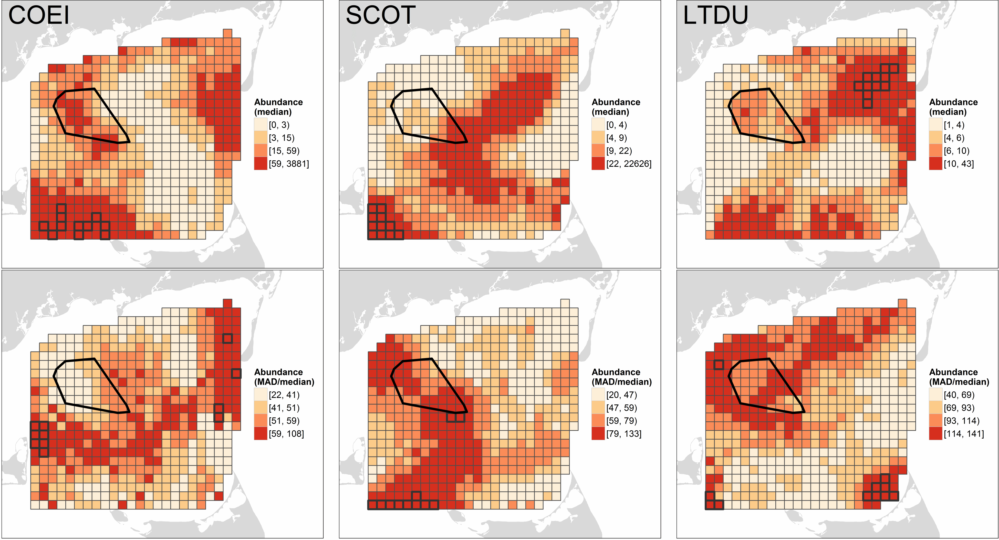
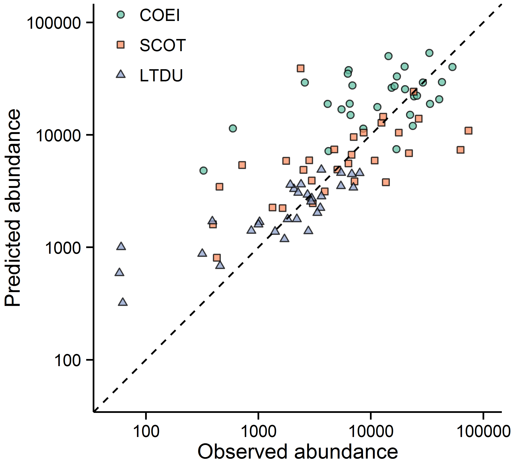

```{r chunk-opts-figs, echo=FALSE}
# Set some knitr chunk options
knitr::opts_chunk$set(eval = FALSE, include = FALSE)
```

## Figure Legends
**Figure 1.** Actual aerial strip transect tracks (gray lines) during winter (October - April, 2003 - 2005) sea duck surveys (n = 30) in Nantucket Sound, Massachusetts, US. The grid indicates the extent of the 1100 km^2^ study area and its division into 504 2.25km^2^ segments. The polygon in northwest Nantucket Sound indicates the 62 km^2^ area of permitted wind energy development on Horseshoe Shoal.

**Figure 2.** Marginal functional plots for stably selected covariates in the occupancy (probability of presence) and conditional abundance (mean and overdispersion of count models) of Common Eider (COEI), scoter (SCOT), and Long-tailed Duck (LTDU) in Nantucket Sound during three winters, 2003 - 2005. Plots illustrate the partial contribution to the additive predictor (Y-axis) of a covariate holding all other covariates at their mean. Within a model, univariate plots (i.e., lines) share a Y-axis scale, enabling direct comparisons of effect sizes among covariates and species. For bivariate plots, the Y-axis and X-axis reflect the first and second variables listed in the interaction, respectively; colors indicate the direction and magnitude of the partial contribution (blacks = negative, reds = positive; darker colors = larger effect) and are likewise comparable within a model. Northing by easting effects are given only at 31 December. For factor variables, only the general association (i.e., positive or negative) with the additive predictor is given. Covariate abbreviations correspond to Equation 1.

**Figure 3.** Occupancy probability for Common Eider (COEI), scoter (SCOT), and Long-tailed Duck (LTDU) in Nantucket Sound during three winters, 2003 - 2005.  Occupancy probabilities (top row) represent the median expected probability of sea duck presence in a 1.5 km x ca. 180 m transect through a given segment predicted on 10 evenly-spaced dates from 15 November through 1 April in each winter.  Spatiotemporal variation in occupancy (%; bottom row) is indicated by the median absolute deviation, MAD, of occupancy probability relative to the median.  Predicted values are categorized based on their quartiles; segments with the highest occupancy or variability (values $\geq$ 98th percentile) are outlined in black.

**Figure 4.** Conditional abundance of Common Eider (COEI), scoter (SCOT), and Long-tailed Duck (LTDU) in Nantucket Sound during three winters, 2003 - 2005.  Conditional abundances (top row) represent the median expected number of sea ducks, assuming their presence, in a 1.5 km x ca. 180 m transect in each segment predicted on 10 evenly-spaced dates from 15 November through 1 April in each winter.  Spatiotemporal variation in conditional abundance (%; bottom row) is indicated by the median absolute deviation, MAD, relative to the median.  Predicted values are categorized based on their quartiles; segments with the highest conditional abundance or variability (values $\geq$ 98th percentile) are outlined in black.

**Figure 5.**  Unconditional abundance of Common Eider (COEI), scoter (SCOT), and Long-tailed Duck (LTDU) in Nantucket Sound during three winters, 2003 - 2005.  Median abundances (top row) represent the expected number of sea ducks along a 1.5 km x ca. 180 m transect within each segment predicted on 10 evenly-spaced dates from 15 November through 1 April in each winter.  Spatiotemporal variation in abundance (%; bottom row) is estimated from the median absolute deviation, MAD, relative to the median.  Predicted values are categorized based on their quartiles; segments with the highest abundance or variability (values $\geq$ 98th percentile) are outlined in black.

**Figure 6.** Relationship between observed and predicted total abundance of Common Eider (COEI), scoter (SCOT), and Long-tailed Duck (LTDU) during 30 aerial surveys of Nantucket Sound over three winters, 2003 - 2005. The dashed line indicates a 1:1 relationship between predicted and observed abundances in surveyed segments; points below and above this line indicate underestimates and overestimates of predicted abundances, respectively.

\newpage

```{r Fig1}
# Figure 1 was created using the following script, although for nice formatting
# in the pdf and Word output we simply link to the final PNG file, below
source("../R/map_study_area.R")
```
  
**Figure 1**

\newpage

```{r Fig2}
# Figure 2 was created using the following script, although some manual editing
# was required to add model column headings.  For nice formatting in the pdf and Word
# output we simply link to the final PNG file, below.
source("../R/assemble_covariate_plot.R")
```
  
**Figure 2**

\newpage
```{r Fig3}
# Figures 3 was created using the following scripts.  However, for nice formatting in the 
# pdf and Word output we simply link to a resized PNG file.
source("../R/NanSound_plot.R")
source("../R/map_occupancy.R")
```
  
**Figure 3**

\newpage

```{r Fig4}
# Figures 4 was created using the following scripts.  However, for nice formatting in the 
# pdf and Word output we simply link to a resized PNG file.
source("../R/map_conditional_abundance.R")
```
  
**Figure 4**

\newpage
```{r Fig5}
# Figures 5 was created using the following scripts.  However, for nice formatting in the 
# pdf and Word output we simply link to a resized PNG file.
source("../R/map_overall_abundance.R")
```
  
**Figure 5**

\newpage
```{r Fig6}
# Figures 6 was created using the following script.  However, for nice formatting in the 
# pdf and Word output we simply link to a resized PNG file.
source("../R/compare_predicted_vs_counted.R")
```
  
**Figure 6**