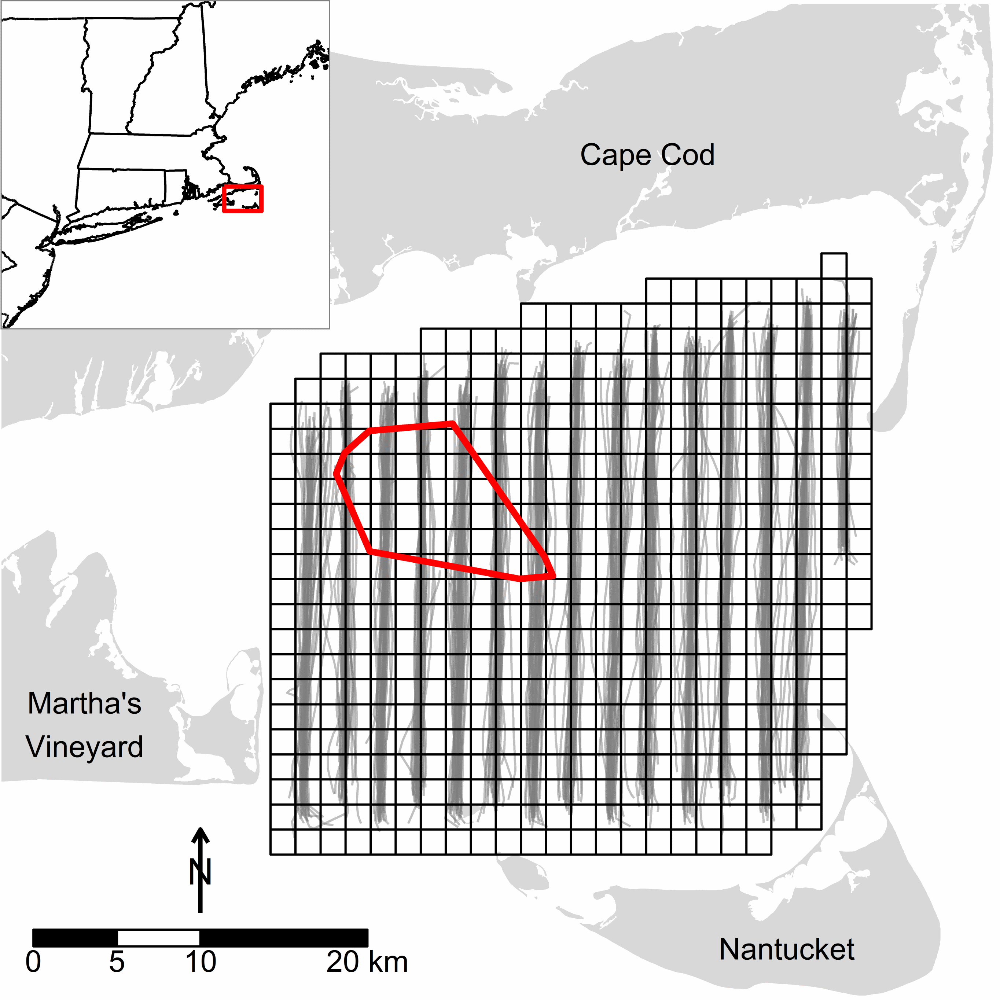

```{r chunk-opts, echo=FALSE}
# Set some knitr chunk options
options(width = 250, scipen=999)
knitr::opts_chunk$set(dev="png", 
               dev.args=list(type="cairo"),
               dpi=96,
               message=FALSE, warning=FALSE, echo=FALSE, 
               fig.path="./Rpubs/figs/", 
               cache.path="./Rpubs/cache/")
```

```{r load-options-data}
# Aliases and functions
devtools::source_gist(9216051) # Rprofile.R
devtools::source_gist(9216061) # various.R

# Necessary packages; other packages will be loaded when other files are sourced
toLoad = c("Hmisc", "ggplot2", "grid", "gridExtra", "rgdal", 
           "reshape", "plyr", "dplyr", "gamlss.tr", "gamboostLSS")
instant_pkgs(toLoad); rm(toLoad)

# Load sea duck data sets
# This includes:
#   env.segs - environmental data from all (504) segments on all (30) survey dates; includes
#              field (length) that indicates the amount of survey effort (if any) on a given
#              date
            
#   obs.final - segment level count summaries for each species/group
load("../Data/ducks&environment.RData")

# For each group, load/create data sets for various analyses
# This creates the (1) final survey data set (e.g., coei), (2) zero-truncated
#   data set (i.e., at least 1 duck observed; e.g., coei_zerotrunc), and 
#   (3) presence/absence data set (e.g., coei_zero) 
source("../R/load_sea_duck_data.R")

# Loading & renaming the sea duck occupancy and hurdle models
source("../R/load_sea_duck_models.R") # takes a while

# Load predict function for combined occupancy/count models
source("../R/predict.gamlssHurdle.R")
```

```{r get_predictions, cache=TRUE}
# For each group, create data for prediction
# This does two important things: (1) creates the final data set over which 
#   model predictions are desired (e.g., coei_pred) and (2) calculates the average
#   of relevant variables (covar_avgs) so that partial effect plots can be placed
#   on their original scale for easier interpretation
source("../R/create_new_data.R")

# Note, loading the sea duck models will not work with Github given file size limitations
# At present, it accesses the models stored on the local drive
# Can we store the files online somewhere and access them that way?
source("../R/predict_from_new_data.R")
```

**Benjamin,** 

**First, I apologize that much of this manuscript is incomplete.  I wanted to get your feedback before you leave the office.  However, you can hopefully get a feel for where it's going.  What I would like you to take a first stab at, though, is a short paragraph in the introduction that explains why this method is to be preferred for this application - i.e., predicting the distribution and (relative) abundance of animals based on surveys and available environmental covariates.  I suspect you've already written something along these lines?  If not, I can take a first attempt.**

**Second, I would value your additions, edits, or comments in our description of the statistical methodology and any place you see something in bold (including Appendix 1 and 3).  Of course your comments are welcome anywhere in the document; I simply highlight where your assistance is most appreciated.**

**Third, my spatiotemporal plots remain more "complicated" than those you created in our recent proceedings paper, as you can see in Figure 2.  I have yet to recreate the plot with a clean session, but I'll do so in short order.**

Biophysical features at multiple spatial and temporal scales affect the distribution and abundance of vertebrates and their prey (*general citations*). Nonetheless, these key environmental factors have not been revealed for many species that inhabit marine ecosystems despite increasing anthropogenic impacts on these systems (*citations*). The distribution and abundance of top consumers in marine ecosystems, such as sea ducks (Tribe Mergini), are notably understudied. Moreover, current evidence suggests that populations of most species of North American sea ducks are below historic levels with negative or unknown population trends [@Merkel2004; @Cameron2014; @SDJV2014; @Bowman2015].  Thus there exists considerable interest in identifying the biophysical characteristics of the marine environment that influence the distribution and abundance of sea ducks.

At broad spatial scales, the North Atlantic Oscillation can have a major influence on the distribution of sea ducks [@Zipkin2010], and regime shifts in oceanic conditions can also affect sea duck population trends [@Flint2013].  At more localized spatial scales, food availability and quality (Stott and Olson 1973; Guillemette et al. 1993, 1996; Zydelis and Ruskyte 2005, Kirk et al. 2008), preferred food types and foraging strategies (from next paragraph?), substrate characteristics (Zydelis et al. 2006, Loring et al. 2013), ocean depth (Guillemette et al. 1993; Winiarski et al. In press), and anthropogenic disturbances (ferry; shipping activity; Kaiser et al. 2006, SF Bay) can dictate sea duck distribution and abundance.

Although there are many single-species or single-season studies of sea duck distribution and abundance, some of which identify important key env factors (e.g., *citations*), we know of no published studies that apply a consistent quantitative approach applied to aerial survey data to generate predictive models of the distribution and abundance of sea ducks, based on key env factors, at multiple spatial and temporal scales...  Maybe bring up the offshore wind energy stuff...?

**Paragraph on the statistical approach and its benefits**

We applied this statistical approach to model the distribution and abundance of sea ducks...

##Methods

*Aerial transect surveys.*---We conducted aerial surveys throughout an 1,100 km^2^ study area in Nantucket Sound, Massachusetts, USA (Figure 1).  Nantucket Sound is an important wintering area for sea ducks in southern New England [@White2009; @Silverman2013; @Loring2014].  Wind energy development has been fully permitted on 62 km^2^ of Horseshoe Shoal in the northwest portion of the study area (Figure 1). During the winters (late October to mid-April) of 2003-2005, we conducted 30 (2003/2004: 13, 2004/2005: 10, 2005/2006: 7) aerial strip-transect surveys [e.g.,@Pollock2006; @Certain2008] to evaluate sea duck distribution and relative abundance; surveys occurred primarily from mid-November - late March (n = 27), with an occasional October (n = 1) or April (n = 2) survey.  During each survey, we flew along 15 parallel (ca. 2.3 km apart), roughly north-south transects (Figure 1) using a high-wing, twin-engine aircraft (Cessna Skymaster 337) at an average altitude of 152 m and speed of 167 kmh^-1^ (90 kts). This altitude allowed us to identify most birds at the sea surface and reduced the possibility of flushing birds to another part of the study area (i.e., double counting). The airspeed was the slowest at which the aircraft could safely fly. Surveys occurred only on days with wind speeds $\leq$ 15 kts and good visibility (>15 km). All surveys occurred from 0900 to 1600 h (average duration of ~ 2.5 h) to ensure that birds had completed their post-dawn movements but had yet to initiate pre-sunset movements from feeding to roosting areas; this time window also reduced glares due to low sun angles.

On each survey flight, two observers used their unaided eyes to continuously detect individuals or flocks, identifying sea ducks to species with the aid of binoculars as needed. Observers monitored the sea surface on their side of the plane in a ~ 90 m wide transect between ~ 56 - 147 m from the plane; observers could not see beneath the plane out to 56 m on each side of the plane. Our narrow strip width ensured birds were detectable and identifiable with the naked eye and allowed us to avoid situations in which ducks were too abundant or spread over too wide an area to count accurately. This last point was especially relevant because sea ducks occasionally congregated in extremely large groups. Moreover, our flight altitude and narrow transect width increased the likelihood that we met that the assumption of homogeneous detection [at least with regards to survey parameters; e.g., @Certain2008] within the strip transect [@Buckland2012].

Observers verbally communicated duck sightings to a recorder, who entered the number of ducks, species, behavior (i.e., on the water or flying), and geographic location into a laptop computer linked to the plane's onboard GPS; we report results only from ducks observed sitting on the water. Sea duck species of interest included Common Eider (*Somateria  mollissima*; hereafter eider), White-winged Scoter (*Melanitta deglandi*), Surf Scoter (*M. perspicillata*), Black Scoter (*M. americana*), and Long-tailed Duck (*Clangula hyemalis*). However, we considered all scoter species collectively (hereafter, scoters), as it was regularly difficult to identify scoters to species. We subsequently consolidated counts for each species (eider and Long-tailed Ducks) or species group (scoters) into 2.25km^2^ segments (Figure 1); this resolution (1.5 km x 1.5 km) corresponded approximately to the coarsest level of resolution of biophysical covariates (see below).

```{r studyarea, eval=FALSE}
# Figure 1 was created using the following script, although for nice formatting
# in the pdf and Word output we simply link to the final PNG file, below
source("../R/map_study_area.R")
```

  
**Figure 1.** Nantucket Sound, Massachusetts, US study area. The grid indicates the extent of the study area and its division into 504 2.25km^2^ segments. Gray lines indicate all aerial transects flown over the 30 surveys comprising the study. The red polygon in the northwest corner of Nantucket Sound indicates the location of permitted wind energy development on Horseshoe Shoal.

*Modeling approach.*---We related spatiotemporal variation in sea duck occupancy (i.e., probability of presence) and abundance to potentially relevant biophysical and spatiotemporal covariates. **Probably should mention and cite the formal framework here -- functional component-wise gradient descent boosting?**  To do so, we applied a negative binomial hurdle model that separately modeled (1) the probability of occurrence of at least one individual (hereafter referred to as the *occupancy model*) in a given segment using an additive logistic regression model and (2) the abundance of sea ducks in that segment conditional on their presence (hereafter *count model*) using a truncated negative binomial model. The prevalence of zero counts (e.g., `r round(100 * nrow(coei[coei$count == 0,])/nrow(coei))`% of eider segment observations) prompted our use of a hurdle model. We generated separate hurdle models for each sea duck group [i.e., eider, scoters, and Long-tailed Duck; @Zipkin2010].

**The rest of this description is quite important.  We should take great care to explain the relevance of GAMLSS, boosting, early stopping, and stability selection and their relevance, application and benefits.  We can of course reference the appropriate citations for those seeking greatear detail, but we should nonetheless provide a clear account of why this approach was appropriate and prescribed.**

We used generalized additive models for location, scale, and shape (GAMLSS) methods [@Rigby2005] to model the zero-truncated negative binomial count models.  GAMLSS methods extend generalized additive models [GAMs; @Hastie1990; @Wood2006] to allow all parameters of the conditional response distribution to be modeled as a function of relevant covariates [@Rigby2005].  Thus, in the present case, the GAMLSS approach flexibly accommodated potential nonlinearities between covariates and sea duck occupancy and, in the count model, the conditional mean and overdispersion of sea duck abundance. GAMLSS occupancy models reduced to logistic GAMs since the binomial is a single parameter distribution.

We implemented the GAMLSS models in a gradient descent boosting framework [@Friedman2000; @Friedman2001; **are these the most appropriate citations?**] that automatically implements variable and model selection.  That is, the iterative gradient boosting algorithm identifies the most relevant subset of covariates and selects among competing representations of continuous covariates [e.g., linear vs. nonlinear effects of covariates; @Maloney2012].  **Define base-learner briefly here**.  Component-wise gradient boosting selects only the single best-fitting base-learner in each iteration, which thus integrates into the algorithm intrinsic selection of the most relevant covariates and their functional form (i.e., some base-learners may never be selected).  Moreover, variable selection and prediction accuracy are maximized in gradient boosting frameworks, and model overfitting avoided, by stopping the iterative algorithm prior to convergence to maximum likelihood estimates [i.e., early stopping; **BEST CITATION?**; @Maloney2012].  **Should we mention how many iterations?  And why did we use considerably more iterations for scoter count models?**  We used 25-fold subsampling to determine the optimal stopping iteration for each model.  Specifically, we randomly drew (without replacement) 25 samples of size $n/2$ from the original data set. We used the selected sample to estimate the model and the balance of the data in each sample to determine the out-of-bag prediction accuracy (empirical risk) measured by the negative loglikelihood of each model; the optimal stopping iteration (*m*~stop~) is the iteration with the lowest average empirical risk over the 25 bootstrapped samples (**CITATIONS??**).

Despite these agreeable features, boosting methods typically produce "rich" models with many selected base-learners [@Hofner2015a].  **Does this issue apply to GAMs in general, even with penalized splines?  Just curious.**  Thus, we additionally applied stability selection [@Meinshausen2010; @Shah2013] to identify those base-learners, and thus covariates, most commonly selected in each model (i.e., selected on the majority of 100 random subsamples of the data); see Appendix 1 and @Hofner2015b for more details.

*Covariates.*---We evaluated biophysical covariates expected to influence the distribution and availability of benthic prey or the distribution, abundance, and movements of sea ducks (see Appendix 1). Biophysical covariates could be characterized as strictly spatial or temporal effects (i.e., varying only among segments or within or among winters, respectively) or as spatiotemporal effects (i.e., varying among segments and within or among winters; see Appendix 2 *a not yet completed table defining covariates and their abbreviations as used in the model specification*). Additionally, we included interactions that allowed the effects of two covariates to vary over time within a given winter (see Appendix 2).

For each continuous covariate, we specified two base-learners: a linear base-learner and a penalized nonlinear base-learner [i.e., P-splines; @Wood2006] capturing orthogonal deviations to the linear function (see **CITATION** for details).  We dummy-coded categorical covariates, resulting in *K* - 1 linear base-learners for a *K*-level covariate.  To address potential spatial autocorrelation, we included a smooth surface function of the spatial coordinates of segment centers [@Kneib2008]; this surface comprised four base-learners -- linear base-learners for the easting *x* and northing *y* and their interaction, and a penalized nonlinear tensor product P-spline [@Kneib2008; @Kneib2009; @Maloney2012].  We also allowed this surface to vary over time within a winter.  See @Hofner2014 for a detailed description of base-learners.  **Random aside: any expectation of incorporating Complex Regional Spatial Smoothers [@Scott-Hayward2013] into the boosting framework?**

The decomposition of continuous covariates into centered linear and penalized orthogonal nonlinear base-learners allowed us to weight base-learners equally **TO PREVENT??** [@Kneib2009; @Hofner2011].  Specifically, we restricted each base-learner to a single degree of freedom and omitted the intercept term from each base-learner [@Kneib2009; @Hofner2011].  Consequently, we added an explicit linear base-learner for the model intercept. The occupancy and count models had the following structure (see Appendix 2 for descriptions of abbreviated covariates):

\begin{equation}
\begin{aligned}
g(\cdot) =  & int + time + f(time) + SSTw + f(SSTw) + SSTm + f(SSTm) + SSTrel +\\
     & f(SSTrel) + SSTrel \cdot time + f(SSTrel, time) + SBT + f(SBT) + NAOw + \\
     & depth + f(depth) + depth \cdot time + f(depth, time) + d2land + f(d2land) +\\
     & chla + f(chla) + cdom + f(cdom) + f(cdom, chla) + meanphi + f(meanphi) +\\
     & SAR + f(SAR) + tidebmean + f(tidebmean) + tidesd + f(tidesd) + strat +\\
     & f(strat) + ferry + y2004 + y2005 + xkm + ykm + xkm \cdot ykm + \\
     & f(xkm, ykm) + xkm \cdot time + ykm \cdot time + xkm \cdot ykm \cdot time + \\
     & f(xkm, ykm) \cdot time + obs\_window + f(obs\_window).  
\end{aligned}
\end{equation}

In our occupancy models, $g(\cdot)$ is $g(\pi_{\text{sea ducks}})$, the (conditional) occupancy probability of a given duck species or group in a segment and $g$ is the logit link.  In our count models, $g(\cdot)$ took two forms within the GAMLSS framework -- the (conditional) mean count of sea ducks, $g(\mu_{\text{sea ducks}})$, and the (conditional) overdispersion in sea duck counts, $g(\sigma_{\text{sea ducks}})$; $g$ is the log link in both cases.  Base-learners denoted as $f(\cdot)$, e.g., $f(time)$, indicate the penalized nonlinear deviations from the corresponding linear base-learner. The explicit intercept (*int*) was a necessary byproduct of our decomposition of base-learners [see above; @Kneib2009; @Hofner2011].  We note that small values in some segments for the *obs_window* variable, our measure of survey effort (see Appendix 2), impaired the estimability of models including *obs_window* as an offset; we thus included it as a covariate.

**Conclude this section with some mention of how we evaluated model adequacy.  Benjamin, please vet this:** Recent extensions of traditional measures of model fit (e.g., coefficient of determination) to generalized linear mixed models [e.g., @Nakagawa2013; @Johnson2014] do not apply within a boosting framework (**is this true?**).  To evaluate the explanatory power of our models for each species group, we calculated the square of the correlation coefficient between the additive predictor from the combined occupancy and conditional count models [see Equation 6 in @Zeileis2008] against the $log$(observed count + 1).  This gives us an approximation of the amount of variation in sea ducks counts accounted for by our models (**CITATION?**).  What about the pseudo-R^2^ calculations using bootstrap [e.g., @Maloney2012]

All analyses were conducted in R [Version 3.1.2; @RCoreTeam2014] with the add-on packages gamboostLSS [@Hofner2015b], mboost [@Hothorn2015], and stabs [@Hofner2015].  The data and code for reproducing this manuscript and analyses are given as an online electronic supplement at *TBD*.

## Results

**I'm not sure what is the best way to open the results section.  I welcome any ideas or suggestions**

Bootstrapped empirical risk suggested that occupancy models for all species converged on the maximum likelihood estimates (i.e., occupancy models failed to stop early; see Appendix 3).  **brief statement of the implications of convergence/not stopping early.  We won't mention this beyond here.**  Conversely, bootstrapped empirical risks prescribed early stopping for both parameters (i.e., conditional mean and overdispersion) in all count models (see Appendix 3).  Consequently **(is this the consequence?)**, final occupancy models generally contained more covariates than did count models, particularly among stably selected covariates.  Nonetheless, we obtained sparse models that included only a subset of the initially specified base-learners.  Specifically, occupancy and count (conditional mean) models contained only 12% (Long-tailed duck conditional abundance) to 38% (scoter occupancy) of the 48 base-learners available for selection, translating to 3 and 10 of 23 covariates of interest, respectively (Figure 2). **If this is a reasonable opening, should we mention difference between # of "selected" base-learners vs. number of base-learners in the final model?  I think I'd vote against doing so.**  

```{r evaluate_models, eval=FALSE, cache=TRUE}
COEI_eval <- predict.gamlssHurdle(COEIocc, COEIcc, coei)
SCOT_eval <- predict.gamlssHurdle(SCOTocc, SCOTcc, scot)
LTDU_eval <- predict.gamlssHurdle(LTDUocc, LTDUcc, ltdu)
COEI_r2 <- round(100 * with(COEI_eval, cor(log(obs_count + 1), add_pred)^2))
SCOT_r2 <- round(100 * with(SCOT_eval, cor(log(obs_count + 1), add_pred)^2))
LTDU_r2 <- round(100 * with(LTDU_eval, cor(log(obs_count + 1), add_pred)^2))
#`r COEI_r2`%, `r SCOT_r2`%, and `r LTDU_r2`%
```

**This may be the best place to mention model appropriateness/approximate explanatory power:** The eider, scoters, and Long-tailed Duck models explained approximately 12%, 24%, and 16% of the variation in observed (log) sea duck counts, respectively.  **The r^2^s increase slightly from the previous models except for COEI, which dropped from 15% to 12%.  Any concern it decreased given that we only added base-learners?**

*Sea duck occupancy.*---More covariates were consistently selected as stable in occupancy models relative to conditional count models (Figure 2; see below).  However, the suite of stably-selected covariates associated with occupancy was relatively consistent among sea duck species, with modest variation in the form of those associations (Figure 2).  **I think it's worth noting, if I'm correct, that the strong spatiotemporal effect in all three groups suggests we're somewhat deficient in our ability to model the ecology of sea ducks or, more likely, their prey.    How much do we want to go on here describing variables and what forms their associations with occupancy take?**  Spatiotemporal effects (i.e., *x-y* location of segments and within-winter time effects), distance to land, and the survey effort in a given segment were important non-biophysical predictors of occupancy.  Among biophysical variables, monthly sea surface temperature (SST), sea floor surface:planimetric area (SAR), sediment grain size, chromomorphic dissolved organic material (CDOM), and water depth were selected in at least two species groups.  Other effects were less consistent among species.  **Worth noting that the strength of the effects can be gleaned from the figure due to standardization?**  Detailed relationships between covariates and occupancy are provided for eider, scoters, and Long-tailed Duck in *not finished* Appendices 4 - 6, respectively.    

**This text is not finished yet, but next I'll discuss some of the similarities and differences in the species occupancy maps; see Figure 3:** Eider were ...  

*Sea duck conditional abundance.*---In contrast to occupancy, fewer covariates associated consistently with the abundance of sea ducks, conditional on their presence, and the suite of stably-selected effects varied more markedly among sea duck species  (Figure 2).  However, selected variables tended to fall within the suite of covariates selected in occupancy models.  The primary exception to this pattern is the apparent increase in eider and scoter abundance, given presence, in segments with relatively warm or cool SSTs (Figure 2).  **Again, I don't want to dwell too long on describing variables and what forms their associations with conditional abundance take, but the spatiotemporal effect in scoter and Long-tailed Duck again seems to dominate the patterns and suggets our available covariates are incomplete.**

Overdispersion in conditional sea duck abundance also varied with biophysical covariates (Figure 2).  Don't need to belabor this other than to point out that sea duck count variability (i.e., overdispersion) varied over the study area.  **What is the ultimate take-home message here?  That the assumption typically made -- overdispersion is fixed -- doesn't always hold in practice and that it can be useful to consider that variability (overdispersion), not simply the conditional mean, also depends (on some occasions) on covariates?**  Detailed relationships between covariates and conditional abundance and overdispersion are provided for eider, scoters, and Long-tailed Duck in *not finished* Appendices 4 - 6, respectively.

**This text is not finished yet, but do you think it's worth talking about the similarities/differences in conditional abundance maps?  I was only going to do it for $\mu$ (see Figure 4) and reserve $\sigma$ for an appendix, but now I'm thinking that talking about abundance conditional on occupancy is somewhat pointless; what seems most relevant to discuss is the combined occupancy/count model (see next section).  Or, perhaps, it's interesting to compare the patterns of conditional abundance with those of occupancy?  Sometimes they match up, whereas in other areas median occupancy may be lower but, when they ducks are present, they are more abundant (e.g., COEI in the eastern portion of Nantucket Sound) or vice versa (e.g., COEI in the Horseshoe Shoals area).  Your thoughts?** 

*Expected overall sea duck abundance.*---Consolidating the occupancy and conditional count models [according to  Equation 6 in @Zeileis2008] provided an estimate of overall sea duck abundance in the study area over the survey period (Figure 5).  **Again, text not finished but there is plenty to mention with regards to overall abundance and the variation in this abundance over time.**

\pagebreak
```{r covariate_plot, eval=FALSE}
# Figure 2 was created using the following script, although some manual editing
# was required to add model column headings.  For nice formatting in the pdf and Word
# output we simply link to the final PNG file, below.
source("../R/assemble_covariate_plot.R")
```
  
**Figure 2.** **Please check this wording** Partial effects (i.e., covariate effect with all others at their mean) for stably selected covariates in the occupancy (probability of presence) and conditional abundance (mean and overdispersion parameters) of Common Eider (COEI), scoters (SCOT), and Long-tailed Duck (LTDU) in Nantucket Sound during winters 2003 - 2005. Within a model, the magnitude of univariate effects (i.e., lines) is comparable among covariates and species.  For bivariate plots, the Y-axis and X-axis reflect the first and second variables listed in the interaction, respectively; colors indicate the direction and magnitude of the linear predictor (blacks = negative, reds = positive; darker colors = larger effect) and are comparable within a model. Northing by easting effects are given only at the mean survey time although these spatial effects regularly changed over time. For factor variables, only the general association (i.e., positive or negative) with the additive predictor is given.
\pagebreak
```{r occupancy_maps, eval=FALSE}
# Figures 3 was created using the following scripts.  However, for nice formatting in the 
# pdf and Word output we simply link to a resized PNG file.
source("../R/NanSound_plot.R")
source("../R/map_occupancy.R")
```
  
**Figure 3.** Median (first row) and median absolute deviation (MAD; second row) of Common Eider (COEI), scoter (SCOT), and Long-tailed Duck (LTDU) occupancy predicted at 10 dates evenly-spaced from 15 November through 1 April in three winters (2003 - 2005) of aerial surveys in Nantucket Sound.  Predicted values are categorized based on their quartiles; segments with predictions $\geq$ 98th percentile are outlined. Occupancy values represent the predicted probability of sea duck presence in a 1.5 km x ca. 180 m transect through the segment.

\pagebreak
```{r conditional_abundance_maps, eval=FALSE}
# Figures 4 was created using the following scripts.  However, for nice formatting in the 
# pdf and Word output we simply link to a resized PNG file.
source("../R/map_conditional_abundance.R")
```
  
**Figure 4.** Median (first row) and median absolute deviation (MAD; second row) of Common Eider (COEI), scoter (SCOT), and Long-tailed Duck (LTDU) conditional abundance (i.e., given sea duck presence) predicted at 10 dates evenly-spaced from 15 November and 1 April in three winters (2003 - 2005) of aerial surveys in Nantucket Sound.  Predicted values are categorized based on their quartiles; segments with predictions $\geq$ 98th percentile are outlined. Conditional abundance values represent the expected number of sea ducks, conditional on their presence, in a 1.5 km x ca. 180 m transect through the segment.

\pagebreak
```{r overall_abundance_maps, eval=FALSE}
# Figures 5 was created using the following scripts.  However, for nice formatting in the 
# pdf and Word output we simply link to a resized PNG file.
source("../R/map_overall_abundance.R")
```
  
**Figure 5.** Median (first row) and median absolute deviation (MAD; second row) of Common Eider (COEI), scoter (SCOT), and Long-tailed Duck (LTDU) overall abundance (i.e., a function of expected sea duck occupancy and conditional abundance) predicted at 10 dates evenly-spaced from 15 November and 1 April in three winters (2003 - 2005) of aerial surveys in Nantucket Sound.  Predicted values are categorized based on their quartiles; segments with predictions $\geq$ 98th percentile are outlined. Conditional abundance values represent the expected number of sea ducks in a 1.5 km x ca. 180 m transect through the segment.

\pagebreak

## Literature cited