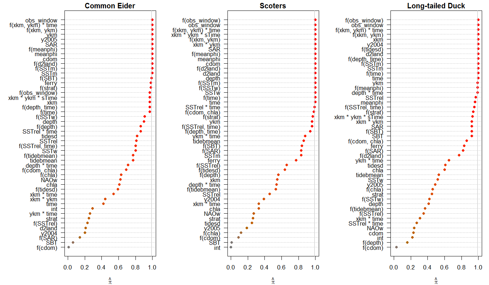
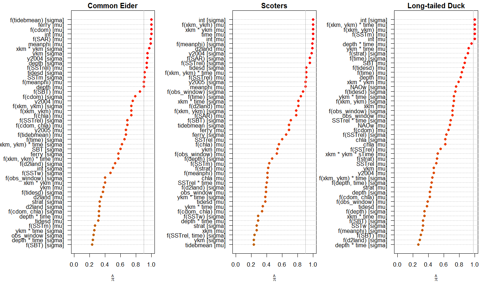

```{r occ_stabsel_results, echo=FALSE, message=FALSE, warning=FALSE}
pacman::p_load(mboost, gamboostLSS)
load("../Results_coei/stabs_zero_q35.Rda")
stabs_zero_q35 <- stabsel(stabs_zero_q35, PFER = 3, assumption = "unimodal")
coei_stabs_zero <- stabs_zero_q35

load("../Results_scot/stabs_zero_q35.Rda")
stabs_zero_q35 <- stabsel(stabs_zero_q35, PFER = 3, assumption = "unimodal")
scot_stabs_zero <- stabs_zero_q35

load("../Results_ltdu/stabs_zero_q35.Rda")
stabs_zero_q35 <- stabsel(stabs_zero_q35, PFER = 3, assumption = "unimodal")
ltdu_stabs_zero <- stabs_zero_q35
```

```{r count_stabsel_results, echo=FALSE}
load("../Results_coei/stabs_hurdle_q35.Rda")
stabs_hurdle_q35 <- stabsel(stabs_hurdle_q35, PFER = 6, assumption = "unimodal")
coei_stabs_hurdle <- stabs_hurdle_q35

load("../Results_scot/stabs_hurdle_q35.Rda")
stabs_hurdle_q35 <- stabsel(stabs_hurdle_q35, PFER = 6, assumption = "unimodal")
scot_stabs_hurdle <- stabs_hurdle_q35

load("../Results_ltdu/stabs_hurdle_q35.Rda")
stabs_hurdle_q35 <- stabsel(stabs_hurdle_q35, PFER = 6, assumption = "unimodal")
ltdu_stabs_hurdle <- stabs_hurdle_q35
```

# S.1 Stability selection

## Methods
We applied stability selection [@MeinshausenBuhlmann2010; @ShahSamworth2013; see also @HofnerEtAl2015a for details in the context of boosting] to identify base-learners, and thus covariates, that were commonly selected in the majority of randomly drawn subsamples of size $\lfloor n/2 \rfloor$ of the data. As proposed by @ShahSamworth2013, we used *B* = 50 complementary pairs subsamples (i.e., we randomly split the data into two halves and used both to independently fit the model). This resulted in 100 total subsamples.  We set the number of selected base-learners per boosting model (*q*) to 35 and established upper bounds of three and six for the occupancy and count model per-family error rates (PFER), respectively. These error bounds corresponded to an upper bound of $\alpha$ = `r round(3/48, 3)` for the per-comparison error rate  in both models.  The different thresholds reflect the different number of base-learners in the two models; occupancy models contained 48 base-learners while the count models contained twice as many base-learners (i.e., 48 each for the mean and overdispersion parameter). The choice of *q* is somewhat arbitrary; it is chosen to be large enough to incorporate all important variables in the model [@HofnerEtAl2015a]. We used the unimodality assumption for the computation of the error bounds in the occupancy and count models [@ShahSamworth2013; @HofnerEtAl2015a].

## Results

*Occupancy models*.---Given our specifications (*q* = 35; PFER upper-bound = 3, unimodality assumption), only base-learners selected in at least 99 of the 100 subsamples (i.e., $\pi_{\text{thr}}$ = `r stabs_zero_q35$cutoff`) were identified as stable (Figure S1.1).

*Count models*.---Given our specifications (*q* = 35; PFER upper-bound = 6, unimodality assumption), only base-learners selected in at least 90 of the 100 subsamples (i.e., $\pi_{\text{thr}}$ = `r stabs_hurdle_q35$cutoff`) were identified as stable (Figure S1.2); this threshold applies to the simultaneous selection of base-learners for the conditional mean ($\mu$) and conditional overdispersion ($\sigma$).
\newpage
\blscape
```{r occ_stabsel_plot, echo=FALSE, eval=FALSE}
# Figure S1.1 was created using the following script, although for nice formatting
# (and time considerations) we simply link to the final PNG file, below
source("../R/stability_selection_occupancy_plot.R")
```
  
**Figure S1** Stability selection using complementary pairs subsampling and unimodality assumption for sea duck occupancy models. The number of selected base-learners in each model run was set to *q* = 35.  Base-learners with selection frequencies above the threshold ($\pi_{\text{thr}}$; vertical gray line) were considered stable with upper bound PFER = 3.   

\newpage
```{r count_stabsel_plot, echo=FALSE, eval=FALSE}
# Figure S1.2 was created using the following script, although for nice formatting
# (and time considerations) we simply link to the final PNG file, below
source("../R/stability_selection_count_plot.R")
```
  
**Figure S2** Stability selection using complementary pairs subsampling and unimodality assumption for sea duck conditional count models. The number of selected base-learners in each model run was set to *q* = 35.  Base-learners with selection frequencies above the threshold ($\pi_{\text{thr}}$; vertical gray line) were considered stable with upper bound PFER = 6.  Only the top 48 (of 96 total) base-learners are illustrated. Brackets indicate the parameter (conditional mean, *mu*, or overdispersion, *sigma*) to which the base-learner applies.

\elscape

## Literature Cited
\setlength{\parindent}{0pt} 
\hangparas{16pt}{1}